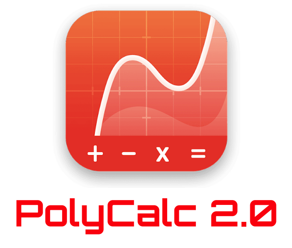
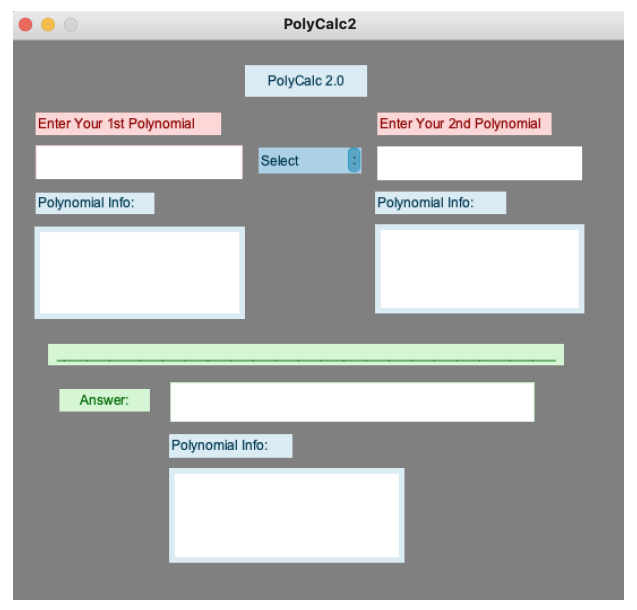
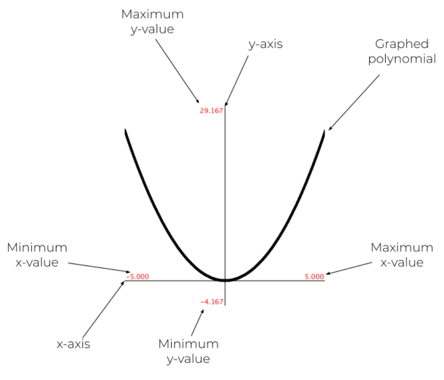

# PolyCalc2.0

    

## Introduction

PolyCalc 2.0 is an advanced polynomial calculator designed to make polynomial operations and graphing simple and accessible. Built with Java using Processing and the G4P graphical user interface, 
it allows users to input and analyze polynomials effortlessly. Whether you're adding, subtracting, multiplying, or exploring roots, derivatives, and extrema, 
PolyCalc 2.0 provides accurate results in seconds. The integrated graphing feature offers a visual representation of polynomial behavior, enhancing comprehension and making it a valuable tool for students and educators alike.

## Features and Functionality

The GUI is user-friendly, with input fields for entering polynomials, drop-down menus for selecting operations, and areas to display results.

    

PolyCalc 2.0 offers a wide range of features to simplify polynomial operations and graphing:

**Polynomial Operations**:
Users can input one or two polynomials and perform essential operations such as:

- Addition
- Subtraction
- Multiplication

**Root, Derivative, and Extrema Calculation**:
The application provides detailed information about the polynomial, including:

- Rational Roots
- Derivatives
- Maxima and Minima

**Graphing**:
The calculator features an integrated graphing tool that allows users to visualize the behavior of polynomials within a specified range. The graphing tool includes:

- Visual representation of polynomial functions
- Display of maximum and minimum values of the polynomial on the graph
- Adjustable x and y value ranges for custom views

    

For a detailed explanation of all features and how to use the interface, please refer to the User Manual.

## Setup and Installation Instructions

Download the latest [Processing](https://processing.org/) and install it on your computer. 
After installing Processing, open the software and navigate to the Sketch menu, then select Import Library and Add Library. 
In the library manager, search for the G4P GUI Library and install it, as this library is required for the graphical user interface. 
Once the library is installed, open the PolyCalc 2.0 project in Processing, and click the Run button to start the application.
